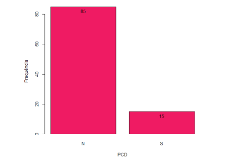
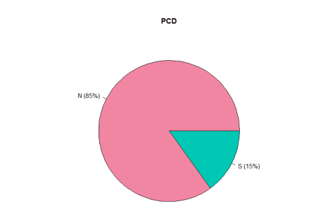
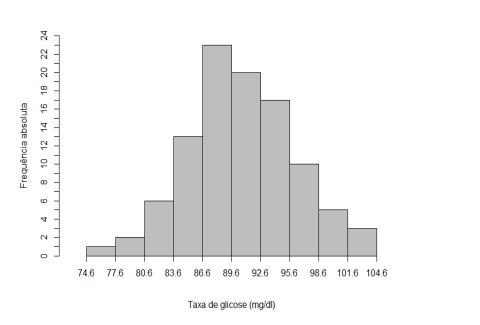
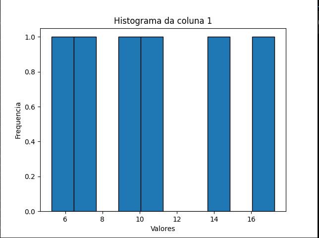
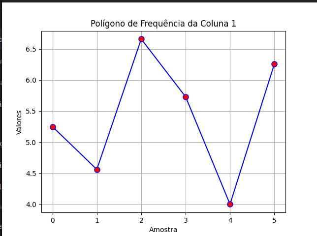
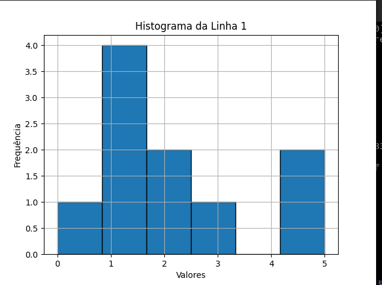
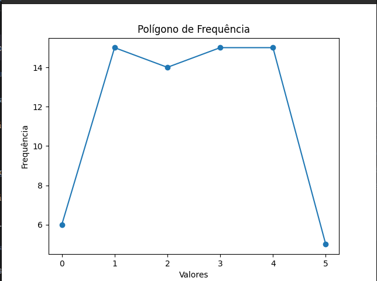

## Estatistica Descritiva

Relembrando alguns conceitos importantes:

-   **População**: Conjunto de todos os elementos que possuem uma característica em comum.

-   **Amostra**: Subconjunto da população.

-   **Variável**: Característica que pode ser medida ou contada.

-   **Variável Qualitativa**: Não pode ser medida ou contada. Ex:
    
        -   Sexo
    
        -   Cor
    
        -   Estado Civil

Pode ser subdivida em:

-   **Variável Qualitativa Nominal**: Não possui ordem. Ex:
    
        -   Sexo
    
        -   Cor
    
        -   Estado Civil

-   **Variável Qualitativa Ordinal**: Possui ordem. Ex:

        -   Grau de instrução
    
        -   Classe social
    
        -   Nível de satisfação

-   **Variável Quantitativa**: Pode ser medida ou contada. Ex:

        -   Altura
    
        -   Peso
    
        -   Idade

Pode ser subdivida em:

-   **Variável Quantitativa Discreta**: Pode assumir valores isolados. Ex:

        -   Número de filhos
    
        -   Número de carros

-   **Variável Quantitativa Contínua**: Pode assumir valores em um intervalo. Ex:

        -   Peso
    
        -   Altura
    
        -   Salário

-   **Censo**: Quando a população é estudada por completo.

-   **Parâmetro**: Característica da população.

-   **Dado**: Valor assumido pela variável.

De onde vem os dados?

-   **Dados Primários**: São coletados pelo pesquisador. Por exemplo:

        -   Pesquisa de campo
    
        -   Experimento

-   **Dados Secundários**: São coletados por outra pessoa. Por exemplo:

        -   IBGE
    
        -   Jornais
    
        -   Revistas

A estatistica descritiva se preoucopa com a apresentação dos dados. 

A apresentação dos dados é feita através de tabelas e gráficos.

A análise dos dados é feita através de medidas descritivas.

### Tabelas
Uma tabela deve ser autoexplicativa, ou seja, deve conter um título, fonte e notas.

Uma tabela deve conter:

-   Título. Ex: Tabela 1 - Distribuição de frequência da variável idade.

-   Fonte. Ex: Elaborada pelo autor.

-   Notas. Ex: *a* - Não inclui os dados de 3 pessoas que não informaram a idade.

-   Cabeçalho. Ex: Idade, Frequência, Frequência Relativa, Frequência Acumulada, Frequência Relativa Acumulada.

-   Corpo. Ex: 18

-   Rodapé. Ex: Total

Frequncia: Quantidade de vezes que um dado ocorre.

Frequncia Relativa: Razão entre a frequência e o total de dados. Ex: 18/50 = 0,36

Exemplo de tabelas:

Titulo: Tabela 1 - Distribuição de frequência da variável idade.

Fonte: Elaborada pelo autor.

| Idade | Frequência | Frequência Relativa | Frequência Acumulada | Frequência Relativa Acumulada |
|-------|------------|---------------------|----------------------|-------------------------------|
| 18    | 18         | 0,36                | 18                   | 0,36                          |
| 19    | 10         | 0,20                | 28                   | 0,56                          |
| 20    | 8          | 0,16                | 36                   | 0,72                          |
| 21    | 6          | 0,12                | 42                   | 0,84                          |
| 22    | 4          | 0,08                | 46                   | 0,92                          |
| 23    | 2          | 0,04                | 48                   | 0,96                          |
| 24    | 2          | 0,04                | 50                   | 1,00                          |
| Total | 50         | 1,00                |                      |                               |

Apresentação dos dados qualitativos:

Titulo: Tabela 2 - Distribuição de frequência da variável sexo.

Fonte: Elaborada pelo autor.

| Sexo | Frequência | Frequência Relativa | Frequência Acumulada | Frequência Relativa Acumulada |
|------|------------|---------------------|----------------------|-------------------------------|
| M    | 25         | 0,50                | 25                   | 0,50                          |
| F    | 25         | 0,50                | 50                   | 1,00                          |
| Total| 50         | 1,00                |                      |                               |

## Representação gráfica:

### Gráficos de barras

Exemplo de gráfico de barras:

Este gráfico é chamado de gráfico de colunas pois os dados estão dispostos em colunas.

Titulo: Gráfico de colunas referentes à ocorrencia de morador PCD nas residencias da area de implementação da ESF da cidade SR.

### Gráfico de setores:

Cada fatia representa uma parte do todo.

Titulo: Gráfico de pizza referente à ocorrencia de morador PCD nas residencias da area de implementação da ESF da cidade SR.

## Apresentação dos dados quantitativos discretos:

É comum termos uma tabela de frequência mais simples, na qual se representa a frequencia absoluta de cada valor assumido pela variavel (Fi); as frequencias relativas(Fr); Fr = Fi/n; e as frequencias percentuais (Fp); Fp = Fi/n * 100.

Exemplo:

Comsiderando o estudo de caso: implantação da ESF na Cidade SR, desejamos analisar a váriavel Numero de crianças na residencia:

Tabela 1: Frequencia do numero de crianças por residencia na ára de implementação da ESF da cidade SR.

| Numero de contaminados| Frequencia (Fi) | Frequencia Relativa (Fr)| Frequencia Percentual (Fp %) |
|--------------------|------------|---------------------|-----------------------|
| 0                  | 40        | 0,400                | 40                    |
| 1                  | 32        | 0,320                | 32                    |
| 2                  | 18         | 0,180                | 18                    |
| 3                  | 5          | 0,050                | 5                    |
| 4                  | 3          | 0,030                | 3                    |
| 5                  | 2          | 0,020                | 2                    |
| Total              | 100        | 1,000                | 100                    |

Perguntas relacionadas a interpretação da tabela:

1.  Qual o numero de residencias pesquisadas?

    R: 100

2.  Qual o numero de residencias que não possuem crianças?

    R: 40

3.  Qual o numero de residencias que possuem 3 crianças?

    R: 5

4.  Qual o percentual de residencias que possuem 2 crianças?

    R: 18%

5.  Qual o percentual de residencias que possuem 4 crianças?

    R: 3%

6. Qual a porcentagem de residencias com mais de uma criança?

    R: 58%

7. Qual a porcentagem de residencias com no minimo três crianças?

    R: 10% 

8. Qual a porcentagem de residencias com no maximo duas crianças?

    R: 90%

## Organização e apresentação dos dados quantitativos contínuos:

A organização e apresentação dos dados quantitativos contínuos é feita através de classes.

Distriuição de frequência é a organização dos dados em classes.

O numero de elementos associados a cada classe representa a frequencia da classe.

A frequencia relativa de cada classe é dada pela razão entre a frequencia da classe e o numero total de elementos.

Construção de uma tabela de distribuição de frequência (TDF):

Exemplo:

 Informações sobre os resultados de 100 exames de sangue, referente à taxa de glicose, em
miligramas por decilitro (mg/dL), em uma amostra de residentes da área de implantação da ESF na Cidade SR.

| 100 | 101 | 102 | 103 | 104 | 105 | 106 | 107 | 108 | 109 |
|-----|-----|-----|-----|-----|-----|-----|-----|-----|-----|
| 110 | 111 | 112 | 113 | 114 | 115 | 116 | 117 | 118 | 119 |
| 120 | 121 | 122 | 123 | 124 | 125 | 126 | 127 | 128 | 129 |
| 130 | 131 | 132 | 133 | 134 | 135 | 136 | 137 | 138 | 139 |
| 140 | 141 | 142 | 143 | 144 | 145 | 146 | 147 | 148 | 149 |
| 150 | 151 | 152 | 153 | 154 | 155 | 156 | 157 | 158 | 159 |
| 160 | 161 | 162 | 163 | 164 | 165 | 166 | 167 | 168 | 169 |
| 170 | 171 | 172 | 173 | 174 | 175 | 176 | 177 | 178 | 179 |
| 180 | 181 | 182 | 183 | 184 | 185 | 186 | 187 | 188 | 189 |
| 190 | 191 | 192 | 193 | 194 | 195 | 196 | 197 | 198 | 199 |

Seria possivel extrair alguma informação útil destes valores? Não, pois não há organização.

Seria interessante apresentar desta forma? Não, pois não há organização.

A solução para esse problema então é sumarizar os dados em classes.

Para isso, devemos seguir os seguintes passos:

1. Determinar o numero de classes (K), para o qual seguem-se os seguintes passos:

    1. Determinar o numero de elementos da amostra (n).

    2. Determinar a raiz quadrada de n.

    3. Arredondar o resultado para o inteiro mais proximo.

    4. Determinar o numero de classes (K) de acordo com a seguinte regra:

        - Se o resultado do passo 3 for menor que 5, então K = 3.

        - Se o resultado do passo 3 for maior ou igual a 5, então K = 5.

2. Determinar a amplitude total (A) da distribuição de frequência, de acordo com a seguinte regra:

    - A = maior valor - menor valor

3. Determinar a amplitude de classe (C), de acordo com a seguinte regra:
    
        - C = A/K-1

4. Determinar as classes: sejam LI e LS, os limites inferior e superior da classe, respectivamente, de acordo com a seguinte regra:

    - LI = menor valor - 0,5

    - LS = LI + C

5. Determinar o ponto médio (xi) de cada classe, de acordo com a seguinte regra:

    - xi = (LI + LS)/2

6. Calcular os valores das frequencias absolutas (Fi), frequencias relativas (Fr) e frequencias percentuais (Fp) de cada classe, de acordo com a seguinte regra:

    - Fi = numero de elementos da amostra que pertencem à classe

    - Fr = Fi/n

    - Fp = Fr * 100

7. Calcular os valors das frequencias relativas(FR): FR = Fi/n

8. Calcular os valores das frequencias percentuais (Fp): Fp = Fr * 100

9. Calcular os valores das frequencias acumuladas (Fa) e frequencias relativas acumuladas (Fra) de cada classe, de acordo com a seguinte regra:

    - Fa = soma das frequencias absolutas das classes anteriores, incluindo a classe em questão

    - Fra = Fa/n

Agora montando a mesma tabela para esse sistema reformulado:

| Classe | Limite Inferior (LI) | Limite Superior (LS) | Ponto Médio (xi) | Frequencia (Fi) | Frequencia Relativa (Fr) | Frequencia Percentual (Fp %) | Frequencia Acumulada (Fa) | Frequencia Relativa Acumulada (Fra) |
|--------|----------------------|----------------------|------------------|----------------|--------------------------|------------------------------|--------------------------|-----------------------------------|
| 100    | 99,5                 | 104,5                | 102              | 5              | 0,05                     | 5                            | 5                        | 0,05                              |
| 105    | 104,5                | 109,5                | 107              | 10             | 0,10                     | 10                           | 15                       | 0,15                              |
| 110    | 109,5                | 114,5                | 112              | 20             | 0,20                     | 20                           | 35                       | 0,35                              |
| 115    | 114,5                | 119,5                | 117              | 30             | 0,30                     | 30                           | 65                       | 0,65                              |
| 120    | 119,5                | 124,5                | 122              | 20             | 0,20                     | 20                           | 85                       | 0,85                              |
| 125    | 124,5                | 129,5                | 127              | 10             | 0,10                     | 10                           | 95                       | 0,95                              |
| 130    | 129,5                | 134,5                | 132              | 5              | 0,05                     | 5                            | 100                      | 1,00                              |
| Total  |                      |                      |                  | 100            | 1,00                     | 100                          |                          |                                   |

Perguntas relacionadas a interpretação da tabela:

1.  Qual o numero de elementos da amostra?

    R: 100

2.  Qual o numero de elementos da amostra que possuem taxa de glicose entre 100 e 105 mg/dL?

    R: 5

3.  Qual o numero de elementos da amostra que possuem taxa de glicose entre 100 e 110 mg/dL?

    R: 35

4.  Qual o numero de elementos da amostra que possuem taxa de glicose entre 100 e 115 mg/dL?

    R: 65

5. Qual o numero de elementos da amostra que possuem taxa de glicose entre 100 e 120 mg/dL?

    R: 85

6. Qual o numero de residentes com taxa de glicose mínima de 120 mg/dL?

    R: 15

7. Qual a porcentagem de residentes com taxa de glicos mínima de 120 mg/dL?

    R: 15%

8. Qual a porcentagem de residentes com taxa de glicos máxima de 120 mg/dL?
    
    R: 85% 

### histograma

O histograma é um gráfico de barras verticais que representa a distribuição de frequência de uma variável quantitativa contínua.

Exemplo:

Titulo: Histograma referente à taxa de glicose em mg/dL de residentes da área de implementação da ESF na Cidade SR.

Poligono de frequencia é um gráfico de linhas que representa a distribuição de frequência de uma variável quantitativa contínua.

## Exercicios:

1. Informações sobre os resultados de 36 exames de sangue, referente à fração de colesterol de muito baixa
densidade (VLDL), em miligramas por decilitro (mg/dl), em indivíduos do sexo feminino.

| 5,25     | 9,57     | 7,59     | 13,85    | 11,06    | 17,26    |
|----------|----------|----------|----------|----------|----------|
| 4,56     | 9,55     | 7,39     | 13,60    | 10,76    | 16,61    |
| 6,66     | 9,80     | 8,46     | 15,99    | 12,79    | 22,00    |
| 5,73     | 9,65     | 7,44     | 14,69    | 11,59    | 18,75    |
| 4,00     | 9,54     | 6,86     | 13,23    | 10,53    | 16,22    |
| 6,26     | 9,77     | 8,12     | 14,71    | 12,00    | 19,40    |

a) Construa uma tabela de distribuição de frequência para esses dados, utilizando 5 classes.

b) Construa um histograma para esses dados.

c) Construa um polígono de frequência para esses dados.

d) Construa a tabela de distribuição de frequencia, o poligono e histograma

e) Qual o numero de exames apresentaram valores de VLDL de pelo menos 16,6 mg/dL?

f) Qual o a percentagem de exames que apresentaram valores de VLDL menores que 13,0 mg/dl?

g) Qual o a percentagem de exames que apresentaram valores de VLDL menores que 7,6 mg/dl?

Respostas:

a) Tabela de distribuição de frequência:

| Classe | Limite Inferior (LI) | Limite Superior (LS) | Ponto Médio (xi) | Frequencia (Fi) | Frequencia Relativa (Fr) | Frequencia Percentual (Fp %) | Frequencia Acumulada (Fa) | Frequencia Relativa Acumulada (Fra) |
|--------|----------------------|----------------------|------------------|----------------|--------------------------|------------------------------|--------------------------|-----------------------------------|
| 4,00   | 3,95                 | 5,05                 | 4,50             | 3              | 0,083                    | 8,33                         | 3                        | 0,083                             |
| 6,00   | 5,05                 | 7,05                 | 6,05             | 9              | 0,250                    | 25,00                        | 12                       | 0,333                             |
| 8,00   | 7,05                 | 9,05                 | 8,05             | 12             | 0,333                    | 33,33                        | 24                       | 0,667                             |
| 10,00  | 9,05                 | 11,05                | 10,05            | 8              | 0,222                    | 22,22                        | 32                       | 0,889                             |
| 12,00  | 11,05                | 13,05                | 12,05            | 3              | 0,083                    | 8,33                         | 35                       | 0,972                             |
| 14,00  | 13,05                | 15,05                | 14,05            | 1              | 0,028                    | 2,78                         | 36                       | 1,000                             |
| Total  |                      |                      |                  | 36             | 1,000                    | 100                          |                          |                                   |

b) Histograma:

c) Poligono de frequencia:

d) Tabela de distribuição de frequência, o poligono e histograma:

| Classe | Limite Inferior (LI) | Limite Superior (LS) | Ponto Médio (xi) | Frequencia (Fi) | Frequencia Relativa (Fr) | Frequencia Percentual (Fp %) | Frequencia Acumulada (Fa) | Frequencia Relativa Acumulada (Fra) |
|--------|----------------------|----------------------|------------------|----------------|--------------------------|------------------------------|--------------------------|-----------------------------------|
| 4,00   | 3,95                 | 5,05                 | 4,50             | 3              | 0,083                    | 8,33                         | 3                        | 0,083                             |
| 6,00   | 5,05                 | 7,05                 | 6,05             | 9              | 0,250                    | 25,00                        | 12                       | 0,333                             |
| 8,00   | 7,05                 | 9,05                 | 8,05             | 12             | 0,333                    | 33,33                        | 24                       | 0,667                             |
| 10,00  | 9,05                 | 11,05                | 10,05            | 8              | 0,222                    | 22,22                        | 32                       | 0,889                             |
| 12,00  | 11,05                | 13,05                | 12,05            | 3              | 0,083                    | 8,33                         | 35                       | 0,972                             |
| 14,00  | 13,05                | 15,05                | 14,05            | 1              | 0,028                    | 2,78                         | 36                       | 1,000                             |
| Total  |                      |                      |                  | 36             | 1,000                    | 100                          |                          |                                   |

e) 1

f) 33,3%

g) 8,3%

2. Foi contado o número de crianças que cada uma de 50 famílias escolhidas aleatoriamente no Bairro Pinheirinhos em Alfenas, encontrando-se o seguinte resultado

|         | 0 | 1 | 2 | 3 | 4 | 5 |
|---------|---|---|---|---|---|---|
| Linha 1 | 5 | 3 | 1 | 1 | 0 | 0 |
| Linha 2 | 2 | 4 | 4 | 3 | 3 | 2 |
| Linha 3 | 1 | 1 | 2 | 3 | 4 | 3 |
| Linha 4 | 4 | 0 | 2 | 0 | 5 | 2 |
| Linha 5 | 0 | 0 | 4 | 3 | 2 | 2 |

a) Construa uma tabela de distribuição de frequência para esses dados, utilizando 5 classes.

b) Construa um histograma para esses dados.

c) Construa um polígono de frequência para esses dados.

d) Construa a tabela de distribuição de frequencia, o poligono e histograma

e) Qual o numero de familias que possuem pelo menos 3 crianças?

f) Qual o a percentagem de familias que possuem no maximo 2 crianças?

g) Qual o a percentagem de familias que possuem no minimo 3 crianças?

h) Estes dados são de uma população ou de uma amostra?

i) Classifique a variável em questão.

Respostas:

a) Tabela de distribuição de frequência:

| Classe | Limite Inferior (LI) | Limite Superior (LS) | Ponto Médio (xi) | Frequencia (Fi) | Frequencia Relativa (Fr) | Frequencia Percentual (Fp %) | Frequencia Acumulada (Fa) | Frequencia Relativa Acumulada (Fra) |
|--------|----------------------|----------------------|------------------|----------------|--------------------------|------------------------------|--------------------------|-----------------------------------|
| 0      | -0,5                 | 0,5                  | 0                | 5              | 0,100                    | 10                           | 5                        | 0,100                             |
| 1      | 0,5                  | 1,5                  | 1                | 8              | 0,160                    | 16                           | 13                       | 0,260                             |
| 2      | 1,5                  | 2,5                  | 2                | 12             | 0,240                    | 24                           | 25                       | 0,500                             |
| 3      | 2,5                  | 3,5                  | 3                | 12             | 0,240                    | 24                           | 37                       | 0,740                             |
| 4      | 3,5                  | 4,5                  | 4                | 10             | 0,200                    | 20                           | 47                       | 0,940                             |
| 5      | 4,5                  | 5,5                  | 5                | 3              | 0,060                    | 6                            | 50                       | 1,000                             |
| Total  |                      |                      |                  | 50             | 1,000                    | 100                          |                          |                                   |

b) Histograma:

c) Poligono de frequencia:

d) Tabela de distribuição de frequência, o poligono e histograma:

| Classe | Limite Inferior (LI) | Limite Superior (LS) | Ponto Médio (xi) | Frequencia (Fi) | Frequencia Relativa (Fr) | Frequencia Percentual (Fp %) | Frequencia Acumulada (Fa) | Frequencia Relativa Acumulada (Fra) |
|--------|----------------------|----------------------|------------------|----------------|--------------------------|------------------------------|--------------------------|-----------------------------------|
| 0      | -0,5                 | 0,5                  | 0                | 5              | 0,100                    | 10                           | 5                        | 0,100                             |
| 1      | 0,5                  | 1,5                  | 1                | 8              | 0,160                    | 16                           | 13                       | 0,260                             |
| 2      | 1,5                  | 2,5                  | 2                | 12             | 0,240                    | 24                           | 25                       | 0,500                             |
| 3      | 2,5                  | 3,5                  | 3                | 12             | 0,240                    | 24                           | 37                       | 0,740                             |
| 4      | 3,5                  | 4,5                  | 4                | 10             | 0,200                    | 20                           | 47                       | 0,940                             |
| 5      | 4,5                  | 5,5                  | 5                | 3              | 0,060                    | 6                            | 50                       | 1,000                             |
| Total  |                      |                      |                  | 50             | 1,000                    | 100                          |                          |                                   |

e) 13

f) 76%

g) 24%

h) Amostra

i) Variável quantitativa discreta

3. Seja os dados abaixo referentes à taxa de proteína (g/kg) na carne analisadas em 18 leitoas de um experimento.

|        | Coluna 1 | Coluna 2 | Coluna 3 | Coluna 4 | Coluna 5 | Coluna 6 |
|--------|----------|----------|----------|----------|----------|----------|
| Linha 1 | 10,0     | 10,4     | 10,7     | 11,4     | 11,6     | 12,2     |
| Linha 2 | 12,2     | 12,4     | 12,4     | 12,5     | 13,4     | 13,5     |
| Linha 3 | 13,9     | 14,0     | 14,6     | 15,0     | 15,3     | 15,6     |

a)  Qual o número de animais que apresentaram taxa de proteína menor que 13,5g/kg?

b) Que percentagem de animais apresentaram taxa de proteína menor que 14 g/kg?

c) Construa a tabela de distribuição de frequencia

Respostas:

a) 12

b) 66,7%

c) Tabela de distribuição de frequência:

| Classe | Limite Inferior (LI) | Limite Superior (LS) | Ponto Médio (xi) | Frequencia (Fi) | Frequencia Relativa (Fr) | Frequencia Percentual (Fp %) | Frequencia Acumulada (Fa) | Frequencia Relativa Acumulada (Fra) |
|--------|----------------------|----------------------|------------------|----------------|--------------------------|------------------------------|--------------------------|-----------------------------------|
| 10     | 9,95                 | 10,45                | 10,20            | 6              | 0,333                    | 33,33                        | 6                        | 0,333                             |
| 11     | 10,45                | 11,45                | 10,95            | 4              | 0,222                    | 22,22                        | 10                       | 0,556                             |
| 12     | 11,45                | 12,45                | 11,95            | 4              | 0,222                    | 22,22                        | 14                       | 0,778                             |
| 13     | 12,45                | 13,45                | 12,95            | 2              | 0,111                    | 11,11                        | 16                       | 0,889                             |
| 14     | 13,45                | 14,45                | 13,95            | 1              | 0,056                    | 5,56                         | 17                       | 0,944                             |
| 15     | 14,45                | 15,45                | 14,95            | 3              | 0,167                    | 16,67                        | 20                       | 1,111                             |
| Total  |                      |                      |                  | 18             | 1,000                    | 100                          |                          |                                   |
